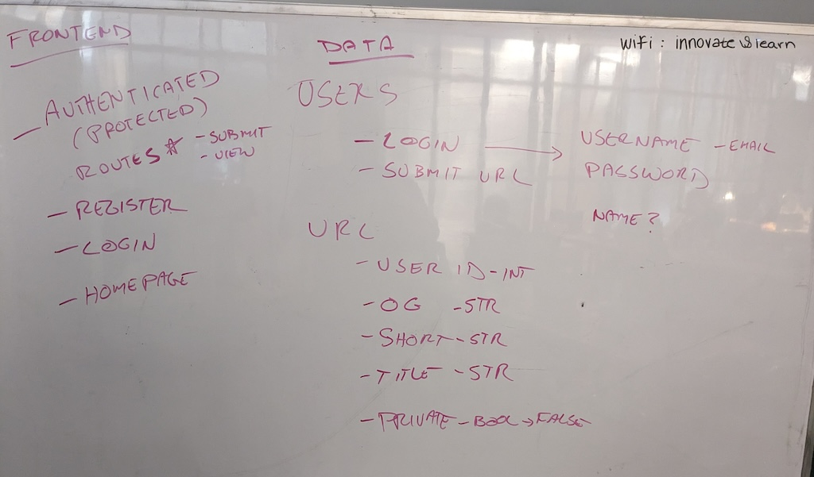

<!-- markdownlint-disable no-inline-html no-trailing-punctuation -->

## CRUDCo

Read through these tutorials in order:

1. [FastAPI: Connecting to Database](https://www.fastapitutorial.com/blog/database-connection-fastapi/)
2. [Alembic for FastAPI](https://www.fastapitutorial.com/blog/alembic-database-fastapi/)
3. [Creating tables in FastAPI](https://www.fastapitutorial.com/blog/creating-tables-in-fastapi/)

:::warning
Don't copy/paste the tutorial verbatim!
:::

### Step 1

- Read through the process, all 3 sections _first_.
- You'll apply the _patterns_ and _processes_ to create a FastAPI install for the CRUDCo backend.
- Make sure your install includes the following:
  - Include `sqlalchemy`
  - Include `uvicorn`
  - Include `psycopg2`
  - Include `alembic` to create tables (_this is new, make sure to read Part 2 above!_)

### Step 2

- Create the link table model _only_
- Use `alembic` to create the table/columns

:::info

The columns will store the following data

- Title
- Original URL
- Short URL
- User ID

Name the columns accordingly.

Reminder: _Use lowercase names, no dashes_.

:::

#### In Class Whiteboard

### Step 3

- Create routes to READ (`get`) and CREATE (`post`) new entries
- Test your routes via Swagger
