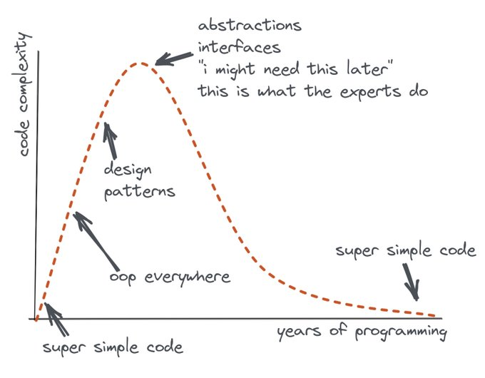

<!-- markdownlint-disable no-trailing-punctuation  no-inline-html -->

## Thoughts on Code Complexity

## First exercise

:::warning
SOMETHING IS BUSTED
:::

- Fork _then_ Clone this repo: [Busted Chuck](https://github.com/seanrreid/busted_chuck_norris)
- Get together as a group and fix it!

<!-- The solution is in [this repo](https://github.com/seanrreid/working_chuck_norris) -->

## Refactoring Chuck

- Upgrading with `async/await`
- Replace functions with Arrow functions

## Lessons

- [Handling Browser Events](/docs/lessons/handling-user-input/handling-browser-events/)
- [Callbacks and Anonymous Functions](/docs/lessons/solving-problems-using-code-js/callbacks/)
- [Common JavaScript Patterns](/docs/lessons/solving-problems-using-code-js/common-patterns/)

## Recommended Reading

- [How does AI impact my job as a programmer?](https://chelseatroy.com/2024/05/26/how-does-ai-impact-my-job-as-a-programmer/)
- [When to Loop? When to Recurse?](https://medium.com/better-programming/when-to-loop-when-to-recurse-b786ad8977de)
   This question plagues me any time I need to work with complex data. Thankfully, those times have been somewhat rare 😂
- [Byte Byte Go: EP77: My Recommended Materials for Cracking Your Next Technical Interview](https://blog.bytebytego.com/p/ep77-my-recommended-materials-for)
   This is a podcast _and_ an article. Both are highly recommended.

## Food for thought

> A complex system that works is invariably found to have evolved from a simple system that worked. A complex system designed from scratch never works and cannot be patched up to make it work. You have to start over with a working simple system.

-- [Gall's Law](<https://en.wikipedia.org/wiki/John_Gall_(author)#Galls_law>)
