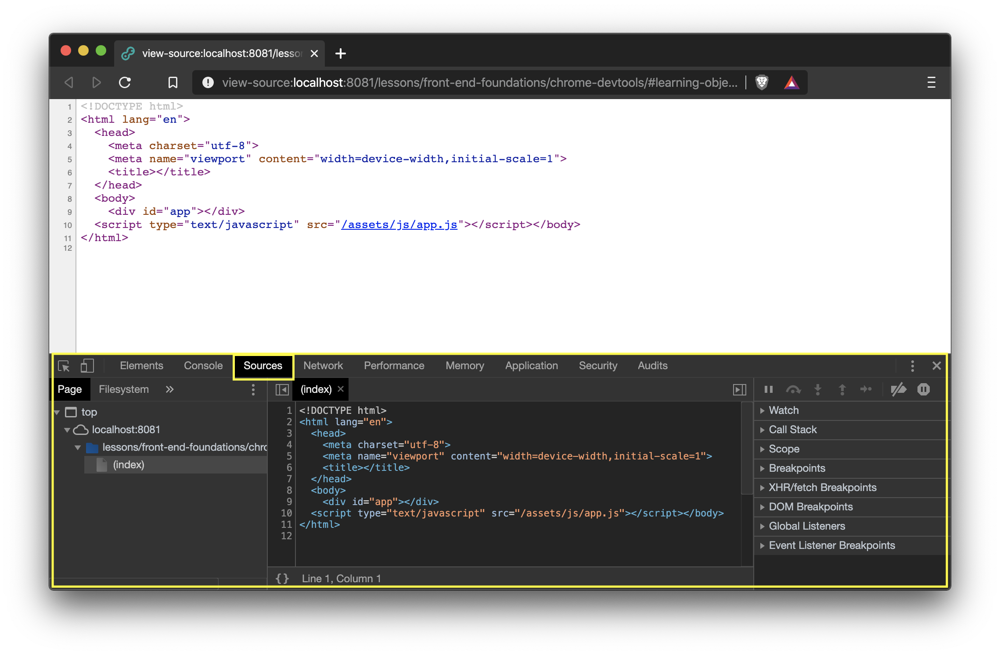
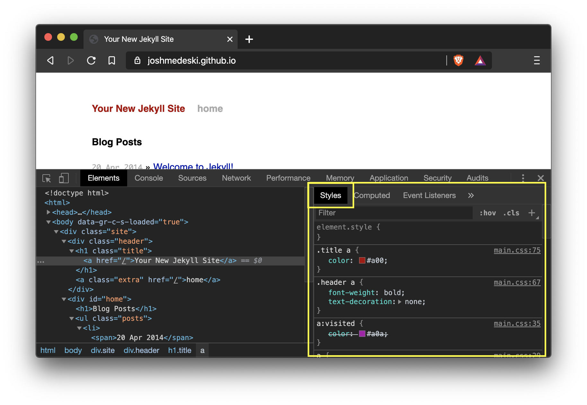
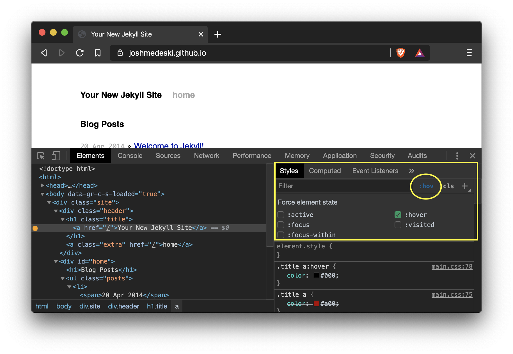
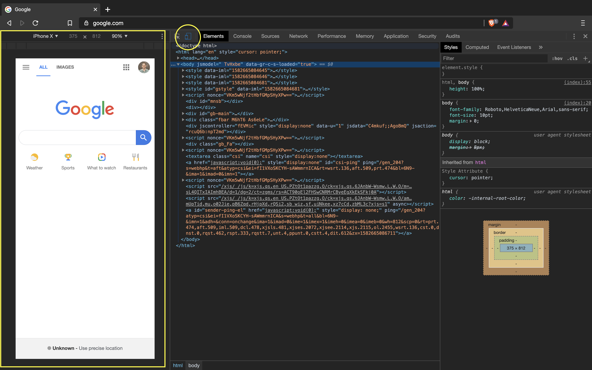
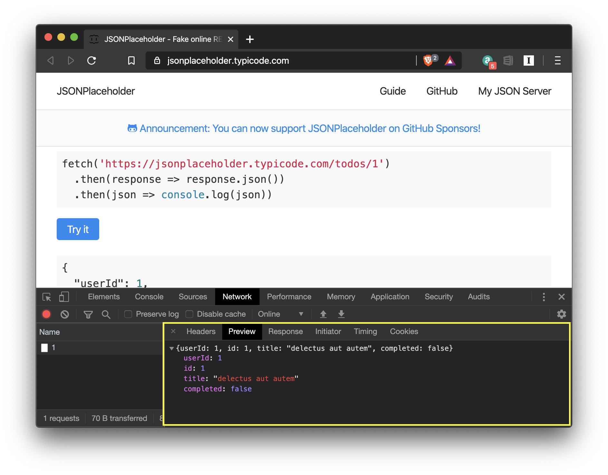

# Chrome DevTools

## Learning Objectives

After completing this lesson, you will be able to do the following with Chrome DevTools:

- View source code
- Use the console for debugging
- Inspect, modify, and add HTML elements in the DOM using the "Elements" tab
- Inspect, modify, and add CSS properties using the "Styles" tab
- Add breakpoints to JavaScript
- Use the device toolbar for responsive testing
- Read network requests
- Manage Local Storage, Session, and Cookies

## Lesson

### Overview

Google's Chrome DevTools offer powerful tools for web developers to debug and alter their website directly within a browser. This direct interaction allows you, the developer, to view source code as well as the compiled output.

DevTools also dives deeper into network requests, screen sizes, and more. In this lesson you will learn the basics so you can use these tools to create websites more efficiently and effectively.

### Sources

Right-click a website and click "View Page Source" to open the HTML's website.

This will display the raw HTML source code for the website.

:::warning Privacy Warning
Due to the nature of how web browsers work, all static assets (HTML, CSS, JS, images) are fully accessible if you publish your website to public domain. Any code loaded by the web browser can be seen by all of your users.

That's why it's important to setup a username and password with back-end validation for private and sensitive information. This will be covered later in the course.
:::

To view all of the source code for a website, including CSS and JS files, you can right click and click "Inspect" in the menu or on macOS you can press `CMD+OPTION+i` to toggle the DevTools panel.

Here you will see all of the source files loaded by the webpage you are visiting. Similar to [Visual Studio Code](https://code.visualstudio.com/) you can press `CMD+p` to pull up a file selection input.

You can change the contents (with some limitations) and you will see the changes reflect on the site. Keep in mind that those changes will be lost if you reload the site.

### Elements

After the DOM is generated, DevTools creates an "Elements" view that shows a visualized tree of all of the generated HTML elements.

In this view you can add, remove, and edit all elements and properties. All change are temporary and will be reset when you reload the page.

### Styles

The styling of elements is found in the "Elements" tab in the right sidebar under "Styles". It will show the CSS styles that apply to the selected element.

You can add and remove any CSS attributes as well as create new selectors including adding styling directly to the element you have selected using the `element.style` box at the top of the styles panel.

Furthermore, you can manually trigger pseudo selectors like `:hover` by clicking on `:hov` in the top bar of the Styles panel which will toggle a view of checkboxes for items like `:hover`, `:visited`, `:active`, etc... You can click the appropriate checkbox to view the output of the CSS.

Styles offers many features including auto-complete, a color picker, contrast ratio calculator, and many more. If you write CSS then it's worth exploring more of the available features.

### Console

The console is a powerful integrated terminal built to run JavaScript code directly in the browser. Any code you log (ex: `console.log()`) will be displayed in the console.

### JavaScript Breakpoints

### Device Toolbar

DevTools has a built in device emulator. Open the inspection tool and click the device icon on the top left of the DevTools top bar or `CMD+SHIFT+M` to toggle.

The device toolbar allows you to choose from common devices like iPhones and Pixels. You can also go into the settings and create your own devices. You can also throttle the internet speed, rotate the screen, and visualize pixels and breakpoints.

### Network

Network requests are how the web works. Every network request for a website is recorded in the "Network" tab in DevTools. From HTML, CSS, JS, images, AJAX requests, etc...

To use it, you have to **first open the Network view** then reload the page and all network requests will be recorded. You can track API requests and responses in the network tab. This is useful for previewing what data comes in and out of your website.

The Network functionality in DevTools can give you details down to the millisecond, throttle your connection, visualize response times, and much more.

### Application

Finally, the "Application" view allows you to examine the storage, cache, background services and more.

When building web apps, it's common to store data in local storage or handle session storage from a cookie. You can view, edit, and clear local storage and cookies from the "Application" view.

### Summary

Now you are introduced to Google's Chrome DevTools and many of the tools it offers including DOM manipulation, CSS customization, JavaScript debugging with breakpoints, device mode for testing responsive design, recording network requests, and managing application storage.

DevTools continues to be developed and is constantly making improvements for the developers using it. Take the time to continue using and learning more about this tool.

### Conceptual

- How does Chrome DevTools improve your developer experience?
- What feature(s) would you like to see added to Chrome DevTools?

### Architect

None available.

## Additional Resources

- [Chrome DevTools - Official Docs](https://developers.google.com/web/tools/chrome-devtools)
- [Video - Traversy Media: Google Chrome Developer Tools Crash Course](https://www.youtube.com/watch?v=x4q86IjJFag)