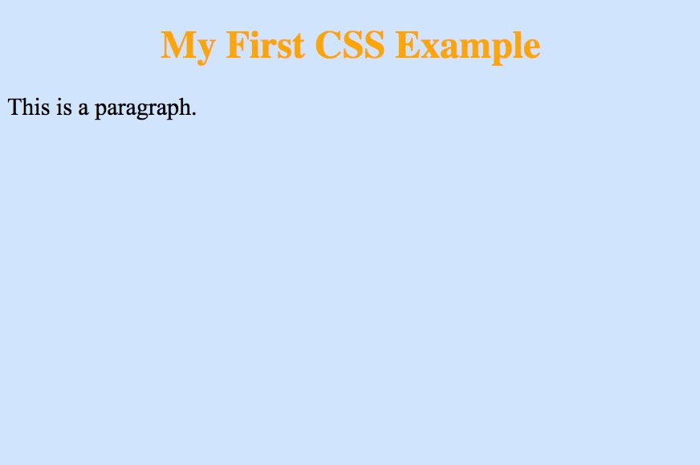
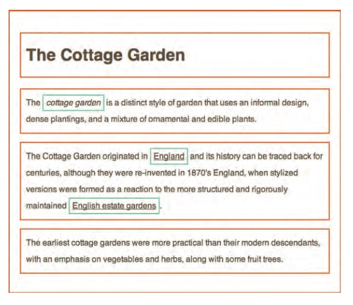
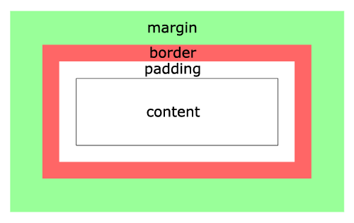

# CSS 101

## Learning Objectives

After completing this lesson, you will be able to:

1. Write CSS
2. Use basic properties to update colors, fonts, etc...
3. Create simple CSS selectors for styling an HTML page
4. Link HTML to CSS inline and with an external file

## Overview

**Cascading Style Sheet (CSS)** is a style language used to adjust colors, fonts, layout, and other styles for a markup language like HTML. Just like the toolbar in Microsoft Word, CSS allows you to change the look and feel of a web page.

### CSS Basics

Here is a basic sample of CSS:

```css
body {
  background-color: #d0e4fe;
}

h1 {
  color: orange;
  text-align: center;
}

p {
  font-family: "Times New Roman", Serif;
  font-size: 20px;
}
```

Here is what that CSS will look like if applied to an HTML document:



### CSS Syntax

The select the area of the HTML you want to style, you use a CSS selector. You can select an element by writing the name of the tag.

```css
h1 {
}
```

The selector's declarations are called inside the curly brackets after the selector and are made of a property and value:

```css
h1 {
  color: green;
}
```

There are many CSS properties ranging from color to font-size to position. Each property has its own potential values. As you start writing CSS you'll get the hang of the available properties and how to use them together to create the layout and style you want.

As discussed in the HTML section, each HTML is built from nested boxes. Many elements are "blocks" and fill the width of the screen, while others are "inline-block" elements and only fill the space of the content (ex: `<span>`).

Here's a visualization of block elements (orange border) and inline block elements (blue border):



Finally, every HTML element is made up of the box model (see picture below). The box model allows you to create complex spacing and layout for any needs. The box model will be taught more in depth when you learn about CSS layout.



### Classes

The most common way to select an element for reusability in CSS is an HTML class.

```html
<div class="card"></div>
```

You select classes in CSS by adding a period to the beginning of the class name:

```css
.card {
  background-color: white;
  padding: 10px;
}
```

This can be helpful when wanting to define styles for an element that isn't already defined as an element. There are also times when you don't want to style all instances of an element, like `h1`, but rather want to style a specific element for a specific reason. For example, if you want to style the title of a blog post, you can create a `.title` class and put it on any `h1` or even put it on another element and get the same styles.

Overall, classes are used for reusability and flexible since you can mix and match them.

### Connecting CSS to HTML

There are two methods for connecting your CSS to your HTML. First, you can include a `<style>` element in your HTML file and write the CSS inside it:

```html
<html>
  <head>
    <title>CSS Styling</title>
    <style>
      body {
        background-color: green;
      }

      h1 {
        font-size: 40px;
      }
    </style>
  </head>
  <body>
    <h1>CSS Styling</h1>
  </body>
</html>
```

The other way is by attaching a style-sheet with the link tag:

```html
<html>
  <head>
    <title>CSS Styling</title>
    <!-- `./` because the file is in the same directory as the HTML file -->
    <link rel="stylesheet" type="text/css" href="./styles.css" />
  </head>
  <body>
    <h1>CSS Styling</h1>
  </body>
</html>
```

`styles.css` (in the same directory)

```css
body {
  background-color: green;
}

h1 {
  font-size: 40px;
}
```

## Summary

- CSS creates **style** for the web (think Word)
- CSS is made up of **selectors**
- CSS selectors have **declarations**
- CSS declarations have **properties** and **values**
- CSS works in a **box**

## Conceptual

- What does "pixel perfect" mean? What would you need to know to accomplish it?
- When is the appropriate time to use the `!important` tag? Why would you avoid it?

[Additional questions](https://www.javatpoint.com/css-interview-questions)

## Additional Resources

- [CSS Cheat Sheet](https://cdn.makeawebsitehub.com/wp-content/uploads/2016/07/css3-mega-cheat-sheet-A4.pdf)
- [w3 Schools' CSS Tutorial](https://www.w3schools.com/css/default.asp)
- [MDN web docs' CSS Reference](https://developer.mozilla.org/en-US/docs/Web/CSS/Reference)
- [CSS Diner](https://flukeout.github.io/)
- [Video: Udemy HTML5 & CSS](https://www.youtube.com/watch?v=5bMdjkfvONE)
