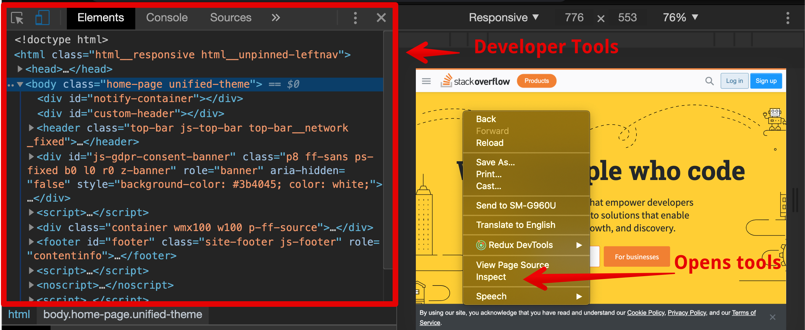
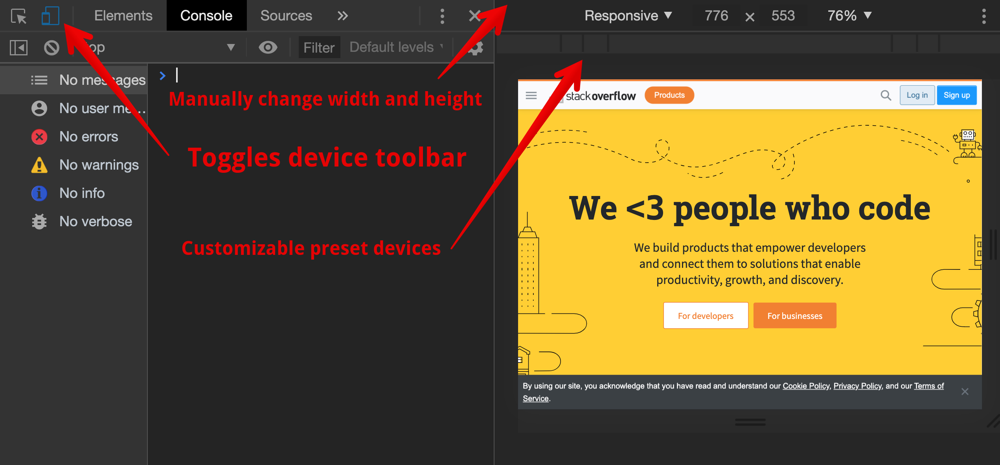
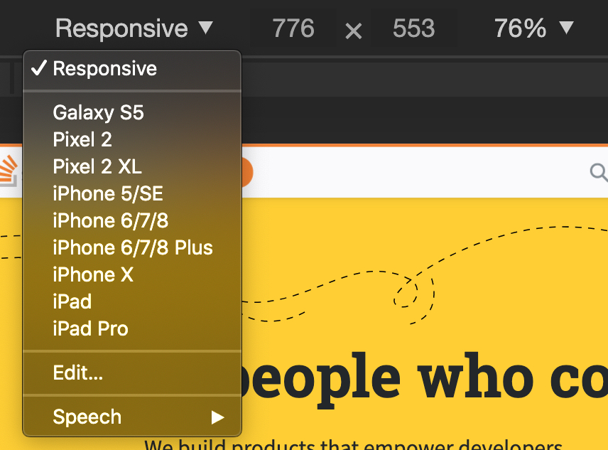
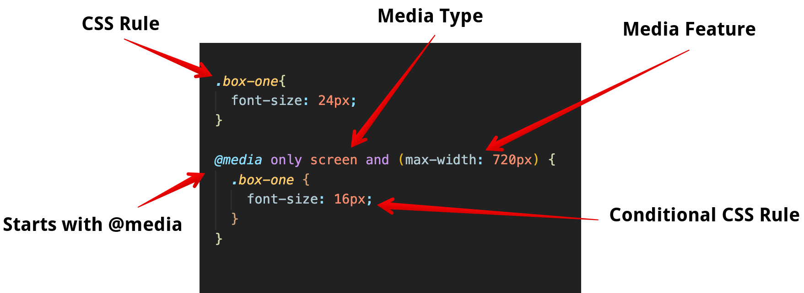

## Learning Objectives

After completing this lesson, you will be able to:

- Make a webpage responsive for different size devices
- Conditionally apply styles with CSS `@media`
- Understand the importance of mobile first development
- Use a media query to create a breakpoint.

## Lesson

### Responsive Design

Responsive Design is an approach to building websites that accounts for the differences in screen sizes across the range of devices and platforms. With this in mind, a website should be viewable on different devices (laptop, phone, etc) by adjusting the content for screen size and orientation. It helps web developers and designers create websites that will render correctly no matter what device their visitors are using.

#### Mobile First Design

When you are creating a website using a Responsive Design, it is recommended to use a process called **Mobile First**. Mobile First development means building a website as a mobile site first and then adding layout rules for larger and larger screens. With the limited size of the mobile screen, it allows developers and designers to focus on delivering the most important content to the largest number of users.

#### Chrome Developer Tools

The Chrome Developer tools are the best available and are built into every version of the Google Chrome browser. Moving forward in your career you will be using the Chrome Developer tools (or more commonly the "DevTools") to design, debug and test your code. To access the DevTools, right click on a web page and select 'Inspect' from the menu. Alternatively, you can press `F12` on your keyboard.



'device toolbar' allows a developer to view a webpage as it would appear on other devices.



This particular tool allows you to easily view your webpage as if it is one of the preset devices.



Clicking on one of the options, setting the size manually, or using the toolbar changes the size of the viewable area (or "viewport") of the website. This lets you see what happens to the content on different screen sizes.

To learn more about the Chrome Developer Tools, visit the [Chrome DevTools page](https://developers.google.com/web/tools/chrome-devtools).

### Using Media Queries

A media query is a feature of CSS3 that enables webpage content to adapt to different screen sizes and devices. It consists of a _media type_ and zero or more expressions that match the type and conditions of a particular _media feature_ such as device width or screen resolution.



In the example, we have a class of `box-one` that we have set the `font-size` property to `24px`. A media query is then used to change the `font-size` property to `16px` when the screen's width is greater than `720px`.

#### Media Types

_Media types_ describe the general category of a device. Except when using the `not` or `only` logical operators, the _media type_ is optional and the `all` type will be used.

```css
@media only screen;
```

Use the `only` keyword to hide CSS Rules from older browsers. If the browser does not support that particular _media feature_, it will ignore all of the CSS Rules inside that media query.

| **Media Types** | Description                                                |
| :-------------: | :--------------------------------------------------------- |
|       all       | Suitable for all devices                                   |
|      print      | Intended for paged documents viewed in print preview mode. |
|     screen      | Intended for screens.                                      |
|     speech      | Intended for screen readers.                               |

The `and` keyword combines a _media feature_ with a _media type_ or other _media feature_. In the example below we are combining our _media type_ `screen` with our _media feature_ `(max-width: 720px)`.

```css
@media only screen and (max-width: 720px) {
}
```

_Media features_ are surrounded by parentheses and describe specific characteristics (e.g. "the device is a screen") or conditions (e.g., "the screen is at least 720 pixels wide"). When a browser has these features then the styling will be applied.

Another way to think of a media query is that it is like an `if` statement for CSS. The conditions are sometimes called _breakpoints_ - at that threshold (a `max-width` for example), the design would "break".

The DevTools allow you to adjust the width of your webpage and see where the styling breaks. Based on that information, you can fine tune your CSS to ensure a great user experience regardless of the device.

Below are some media queries for common devices:

```css
/* Smartphones (portrait and landscape) ---------- */
@media screen and (min-width: 320px) and (max-width: 480px) {
  /* styles */
}
/* Smartphones (portrait) ---------- */
@media screen and (max-width: 320px) {
  /* styles */
}
/* Smartphones (landscape) ---------- */
@media screen and (min-width: 321px) {
  /* styles */
}
/* Tablets, iPads (portrait and landscape) ---------- */
@media screen and (min-width: 768px) and (max-width: 1024px) {
  /* styles */
}
/* Tablets, iPads (portrait) ---------- */
@media screen and (min-width: 768px) {
  /* styles */
}
/* Tablets, iPads (landscape) ---------- */
@media screen and (min-width: 1024px) {
  /* styles */
}
/* Desktops and laptops ---------- */
@media screen and (min-width: 1224px) {
  /* styles */
}
/* Large screens ---------- */
@media screen and (min-width: 1824px) {
  /* styles */
}
```

> [CSS Media Queries - tutorialrepublic.com](https://www.tutorialrepublic.com/css-tutorial/css3-media-queries.php)

## Additional Resources

- [MDN Media Queries](https://developer.mozilla.org/en-US/docs/Web/CSS/Media_Queries/Using_media_queries)
- [CSS Tricks - Media Queries](https://css-tricks.com/snippets/css/media-queries-for-standard-devices/)
- [HTML Element Default CSS Styling](https://www.w3schools.com/cssref/css_default_values.asp)
- [CSS Media Queries: Quick Reference & Guide](https://alligator.io/css/media-queries/)
- [Pixel Identity Crisis](https://alistapart.com/article/a-pixel-identity-crisis/)
- [Common Device Breakpoints](https://responsivedesign.is/develop/browser-feature-support/media-queries-for-common-device-breakpoints/)
