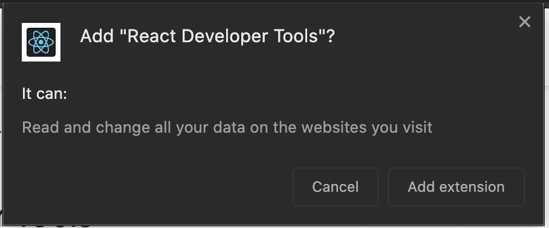
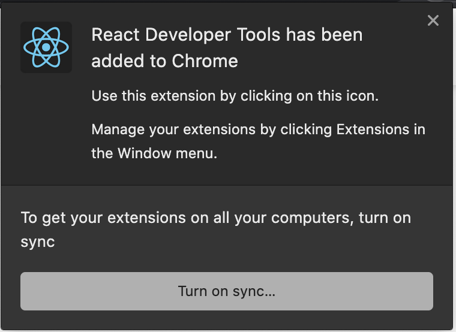
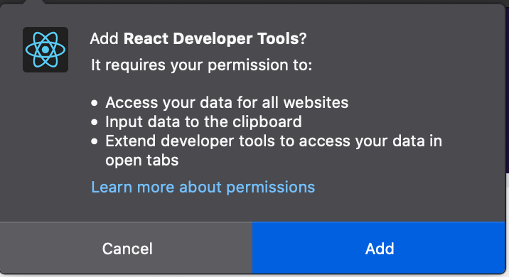
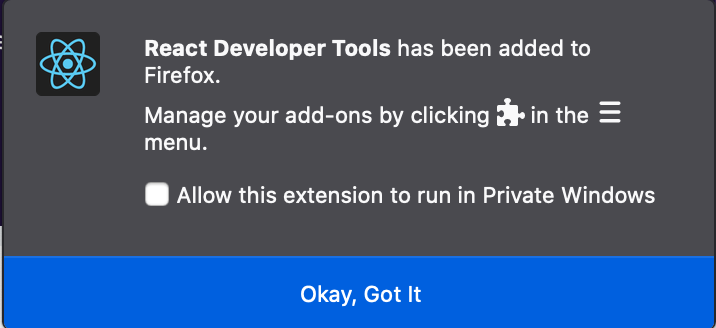
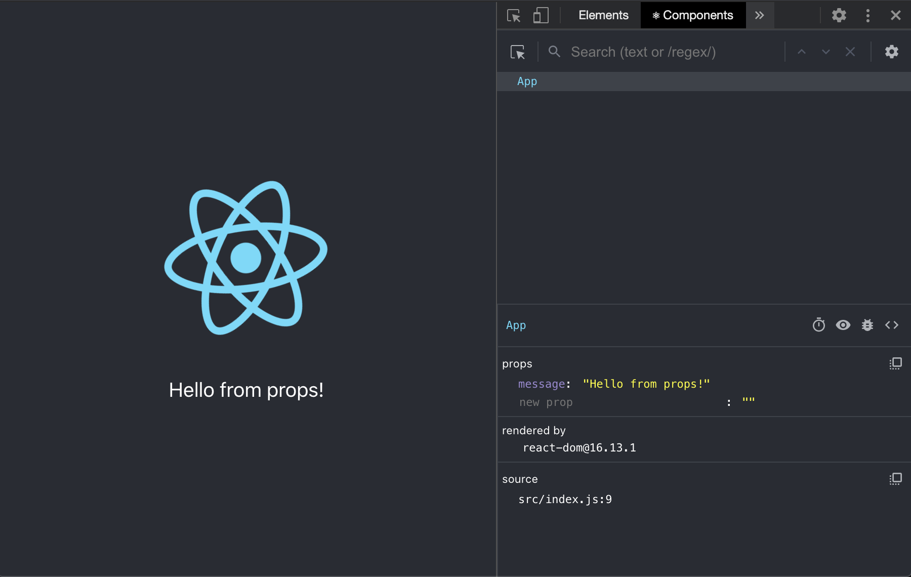
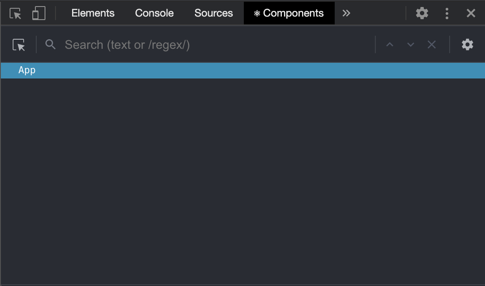
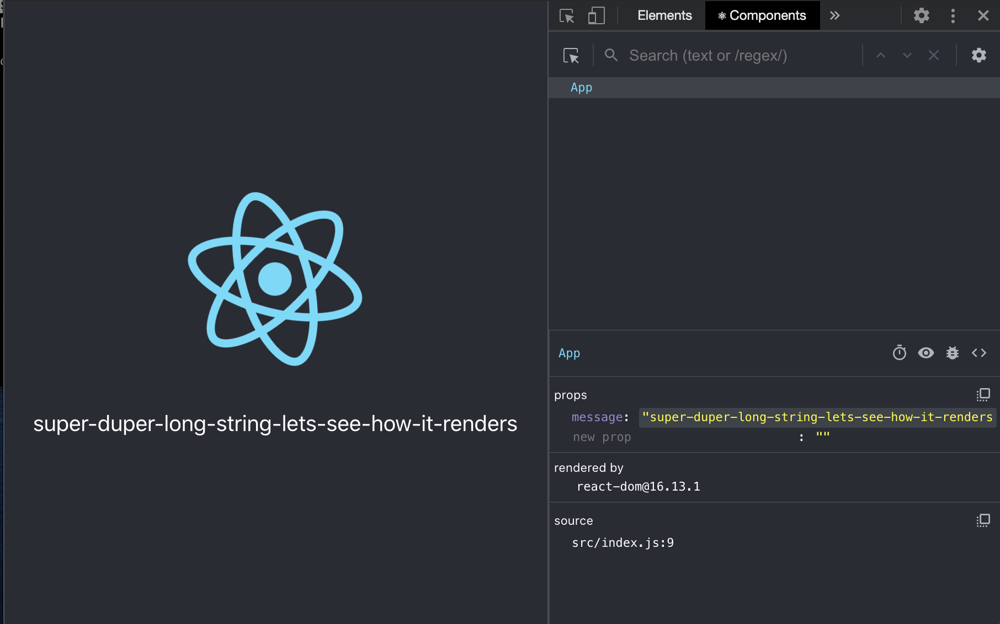
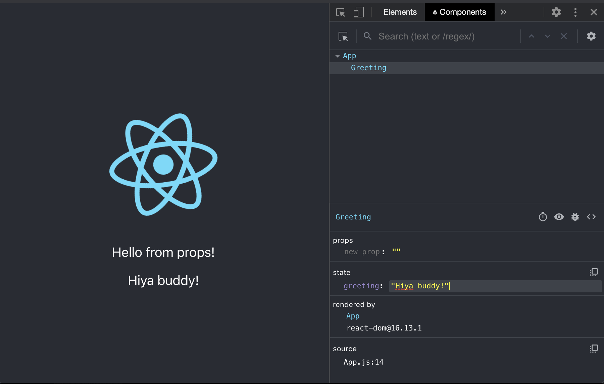

# React DevTools

React Developer Tools is a set of tools designed to help inspect and debug React components. It is made available through extensions to Chrome and Firefox, as well as a standalone app via `npm`

## Learning Objectives

After completing this lesson, you will be able to:

1. Install React DevTools in your browser
1. Inspect a React Component using React DevTools
1. Alter the State or Props of a React Component using React DevTools

## Lesson

### Overview

By now you're familiar with inspecting elements using the built-in developer tools that your browser provides. Being able to inspect the DOM, tweak CSS values, see the generated HTML, etc. is super valuable for front-end work.

Once you start using React and developing components that talk to the internet and to each other, you may realize that good ol' Inspect Element isn't as useful anymore. Remember how React utilizes a Virtual DOM in order to provide fast updates and allow for one part of the page to talk to many others? Unfortunately the browser can only work with its own DOM, and not with a Virtual DOM.

This makes it difficult when you are working with `state` and `props`, and want to see what the current `state` of your component is, or determine whether or not the correct `props` are being set.

This is where React DevTools comes in. Let's start by getting it installed.

### Installation

As mentioned before, React DevTools ships as an `npm` package and can be used as a standalone tool. More commonly, you'll find these tools being utilized via browser extensions.

#### Chrome

[Install for Google Chrome](https://chrome.google.com/webstore/detail/react-developer-tools/fmkadmapgofadopljbjfkapdkoienihi?hl=en)

You can install by clicking the "Add to Chrome" button

Chrome will briefly explain the permissions requested and ask you to confirm that you want to install.


Once installed, Chrome will let you know that the install was successful and provide additional information on using the extension.



#### Firefox

[Install for Firefox](https://addons.mozilla.org/en-US/firefox/addon/react-devtools/)

You can install by clicking on the "+ Add to Firefox" button

Firefox will briefly explain the permissions requested and ask you to confirm that you want to install.



Once installed, Firefox will let you know that the install was successful and provide additional information on using the extension.




### Inspecting Components

Now that you have React DevTools installed, you have a new superpower! Let's take a look at a bare-bones React app and open up the browser's Developer Tools. You'll notice in the tab list, you have access to two new Tabs: :atom_symbol: Components, and :atom_symbol: Profile

:::tip Not seeing the new Tabs?

If you're not seeing the new :atom_symbol: Components and :atom_symbol: Profile tabs, you can click the `>>` icon in the Tab Bar to scroll to them.

:::

We'll be focusing on the :atom_symbol: Components tab. Give it a click, and let's take a look:



On the left, you can see our React app, and on the right you'll see the :atom_symbol: Components pane provided by React DevTools. It is comprised of two major sections: The Virtual DOM Inspector, and the Component Inspector.

#### Virtual DOM Inspector


This is a tree representation of the Virtual DOM and its similar to the "Elements" tab of your browser's Developer Tools. Instead of rendering the entire DOM though, it only renders the Virtual DOM of the React app. This is why we only see a single `<App>` component in the tree. In the next section we'll see this expanded a bit.

You can use this visual representation to find a Component in the tree, and inspect it with the Component Inspector. Let's get on to the fun part...

#### Component Inspector


This is the Component Inspector. It provides:

- The name of the Component
- A few helper tools in a Toolbar
- Details about `state` and `props` that the Component may be using
- Information about what is rendering the Component
- Source code location where the Component was invoked

:::warning

React DevTools is built and maintained to work with some of the newer/advanced React features. A few items in the Component Inspector Toolbar may not be relevant for common usage or older versions of React.

:::

The Component Inspector also has a few handy tools in its own little toolbar. From left to right:


- Suspend the selected component - Only works if component is in a [Suspense Container](https://reactjs.org/docs/concurrent-mode-suspense.html#what-is-suspense-exactly)
- Inspect the matching DOM element -  This will take you to the Elements tab and show you which DOM element corresponds to the Virtual DOM element for the selected Component
- Log the Component data to the console - Quick dump of the Component's state, props, and other useful data to the console
- View the Source of this element - Takes you to the Sources tab, and shows you the source code of the Component

These two panes - the Virtual DOM and the Component Insepctor - are incredibly valuable as you start building more complex applications. They provide you with useful debugging tools as well as a way to manipulate components without making any code changes. Let's take a quick look at that

### Manipulating Components

Let's take a closer look at our `<App>` Component. It looks like this one has been altered to accept a `message` prop. We can see that in the Component Inspector on the right. What if we wanted to try out a super-duper-long-string-to-see-how-it-renders?

You could make the code change and reload, sure. For something a little faster, take a look at the Component Inspector, and give the "Hello from props!" string a click. That's right, you can edit the prop right here and see what it looks like!



Before you ask - yes, you can do this with `state` too. In the next example we've added a Class Component called `Greeting` and have given it a `state`.


You can see now that `<Greeting>` appears below `<App>` in the Virtual DOM. That's because our `<App>` Component looks like this:

```javascript
function App(props) {
  return (
    <div className="App">
      <header className="App-header">
        
        <p>
          {props.message}
        </p>
        <Greeting />
      </header>
    </div>
  );
}
```

We can make changes to the `state` of the `Greeting` component just like we could to props.



These are very simple examples. Like everything else with development, the building blocks here are simple. You can use them to create complex solutions. Or in this case, debug your own complex solutions. Have fun!
