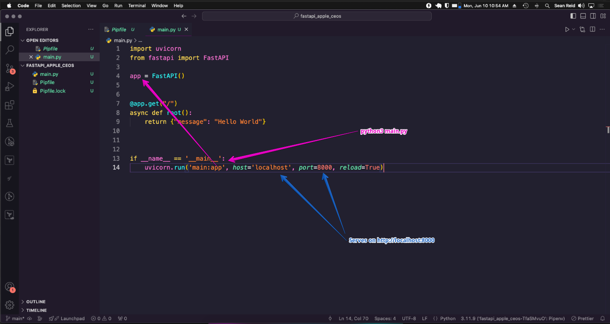

<!-- markdownlint-disable no-inline-html no-trailing-punctuation -->

## First: Career Services Talk + Guest Speaker

- TODAY: Kaity Miller will be joining us to discuss Career Services.
- TOMORROW: We'll have a Caleb Craigo ([LinkedIn](https://www.linkedin.com/in/caleb-craigo)) visit class during office hours from 5:00-6:00 PM tomorrow.
  <br/>Here's a [direct link](https://meet.google.com/zhr-rsgq-toz) to the Google Meet (it's also the same one we use for class).


## Then, time for plumbing!

This week we'll connect all the pipes...


## Presentations

But first, Iron Man!

- [Model/View/Controller (MVC)](https://docs.google.com/presentation/d/1v0l-9MRVO7CmAs74c2zHv-swL52JdJEgZBrU77iqSLU/edit?usp=sharing)

## FastAPI

- We'll start with the [Fast API Tutorial](https://fastapi.tiangolo.com/tutorial/) as a code along in class
- Then we'll start our Shrink Ray API, written in FasAPI

## The MVC(ish) Pattern in FastAPI

- SQLModel (an [ORM](https://sqlmodel.tiangolo.com/db-to-code/)) + FastAPI define Models
- The route handlers essentially act as Controllers
  - It's not a 1-to-1 between a controller in other MVC frameworks, but FastAPI routes do essentially the same thing
- FastAPI doesn't return Views like Django or Express
  - The JSON responses act as kind of "view"
  - The JSON is used by frontend frameworks that create the view layer that clients consume

## Running FastAPI

Rather than running `uvicorn` directly from the command line, we can build it into our app.

Running

```sh
python3 main.py
```

will return:

```py
INFO:     Will watch for changes in these directories: [YOUR REPO DIRECTORY]
INFO:     Uvicorn running on http://localhost:8000 (Press CTRL+C to quit)
INFO:     Started reloader process [4769] using WatchFiles
INFO:     Started server process [4771]
INFO:     Waiting for application startup.
INFO:     Application startup complete.
```

:::tip
The following screenshot show how those calls are translated into running `uvicorn` on our app.



:::

## Comparing CRUD, Routes, and SQL Commands

This table illustrates how a usual CRUD (Create, Read, Update, Delete) application corresponds to application routes, and ultimately the SQL statements that might be triggered by those routes.

| CRUD   | ROUTES | SQL    |
| ------ | ------ | ------ |
| CREATE | POST   | INSERT |
| READ   | GET    | SELECT |
| UPDATE | PUT    | UPDATE |
| DELETE | DELETE | DELETE |


## Notes and Video

- [Class Notes](https://docs.google.com/document/d/1x52aJ33OL-hiDlnwffNTc0I-oybgIKTtoFKrB93WH98/view?usp=sharing)
- [Class Video :movie_camera:](https://drive.google.com/file/d/1AYjRVqF6AnnNNBH1YE0DwYzYGZ9avx5g/view?usp=sharing)
- [Shrink Ray API Repo](https://github.com/buildcarolina/shrinkray_api)