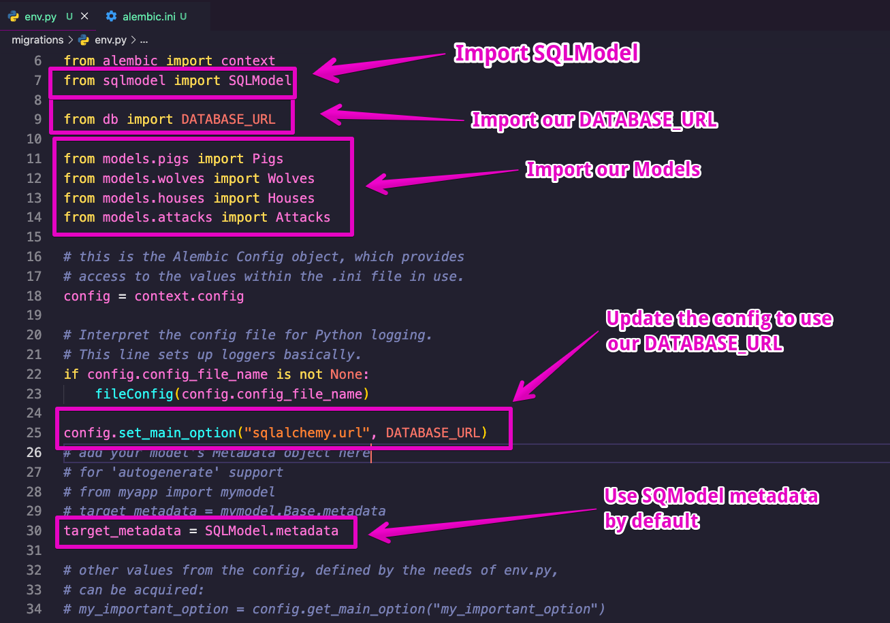

<!-- markdownlint-disable no-inline-html no-trailing-punctuation -->
## Guest Speaker Follow up, Demo Day Prep

- As we're approaching the end, let's talk Career Services, guest speakers, Demo Day, and next steps...

## SQL, but in Python?

Wouldn't it be nice if we could leverage the Python to _create_ our database programatically? :thinking:
<br/>Wouldn't it be even nicer if we could track those changes like we do `git` commits?? :thinking:

That's what we'll do today, using an [ORM called SQLModel](https://sqlmodel.tiangolo.com/db-to-code/) and a tool called [Alembic](https://alembic.sqlalchemy.org/en/latest/).

### Getting Setup...

We'll need be in the correct environment, and include both SQLModel and Alembic:

Using `pipenv`

```bash
pipenv shell
pipenv install alembic sqlmodel
```

OR

Using `venv` and `pip3`

```bash
source env/bin/activate
pip3 install alembic sqlmodel
```

### Add Models

- Remember Iron Man? We're going to write the Jarvis layer, the part that "models" our data for our app.
- Start with a "Base" model, then add models for URLs.
- Every `Base` model will look like the following:

```py
from sqlmodel import Field, SQLModel


class Base(SQLModel):
    id: int = Field(
        default=None,
        primary_key=True,
        index=True,
        nullable=False,
    )
```

- Our `URLs` model will extend this model...

### Initialize Alembic.

- We'll initialize alembic, and tell it to create a folder called `migrations`
- This folder is where the migrations will be stored

```sh
alembic init migrations
```

### Update the Alembic environment

- In the `migrations` folder there is a file called `env.py`.
- Edit the file accordingly to work with SQLModel

```py
## Add this line around Line 7
from sqlmodel import SQLModel, create_engine

## Add your models
## (these are made up names!)
from models.my_model import Foo

## Set the config to use your database URL
config.set_main_option("sqlalchemy.url", [MY DATABSE URL])

## Update this entry to use the SQLModel.metadata
## Around Line 22
target_metadata = SQLModel.metadata
```

:::tip
Every `env.py` should resemble the example below (_YOUR MODELS WILL LOOK DIFFERENT!_):

:::

### Generate the initial migration.

```sh
alembic revision --autogenerate -m "Initial migration"
```

- This command will create a directory in the `migrations` folder called `versions`
- The files in the `versions` folder store all the SQL statements to create/update the tables

:::warning
You'll need to update the migration files to import `sqlmodel` before they can be run!
:::

### Apply the migration

```sh
alembic upgrade head
```

:::tip
Remember those last 2 steps, you'll repeat them when you make future changes to your models!
:::
